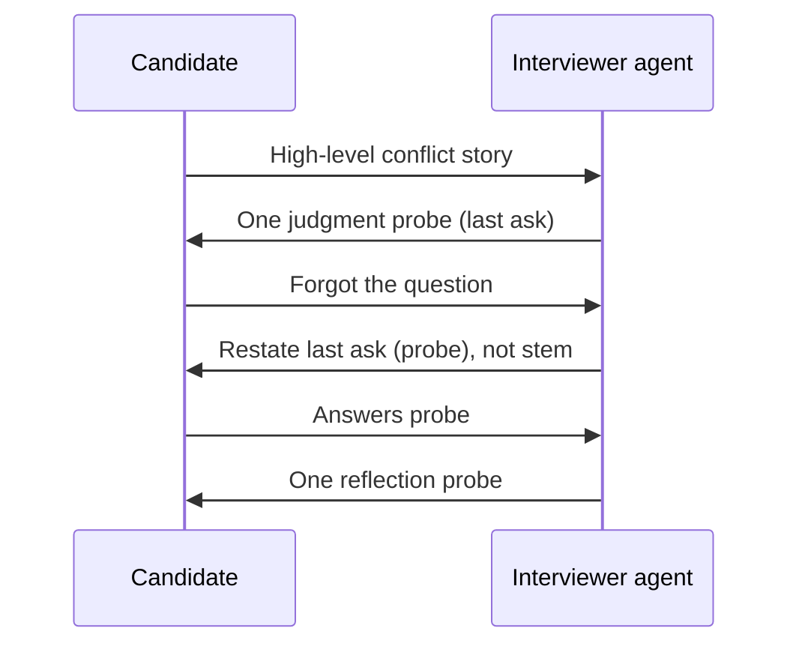

# Walkthroughs

Anonymized **composite** paths. Not real candidate records.  
Purpose: show how the overview map routes — not how production sentences sound.

---

## Walkthrough 1 — Normal deepen → re-anchor to last ask → continue

**Type:** `behavior`

| Turn | Candidate (paraphrase) | Judgment | Action class |
|------|------------------------|----------|--------------|
| 0 | *(system / interviewer already asked stem about a teamwork conflict)* | — | — |
| 1 | Describes a conflict with a teammate at a high level, little decision detail | Normal → concrete episode, missing judgment | `Strategy_Pack(behavior)` → probe judgment → `Ask_Single_Open_Question` |
| 2 | “Sorry — what was the question again?” | `Need_Question_Reanchor` | `Restate_Last_Interviewer_Question` (**the judgment probe from turn 1**, not the stem) |
| 3 | Answers the judgment probe with a concrete choice and trade-off | Normal → reflection still thin | `Strategy_Pack(behavior)` → probe reflection → `Ask_Single_Open_Question` |

### Why this walkthrough exists

A common production failure is restating the **stem** at turn 2.  
The contract says: restate the **last interviewer question in dialogue**.

---

## Walkthrough 2 — Type boundary beats curiosity (`mentalhealth`)

**Type:** `mentalhealth` (workplace resilience)

| Turn | Candidate (paraphrase) | Judgment | Action class |
|------|------------------------|----------|--------------|
| 1 | Shifts into non-work family crisis / clinical detail | Type safety trigger | `Type_Specific_Boundary` → redirect to workplace frame / soft pass |
| 2 | Gives a short workplace deadline example | Normal | `Strategy_Pack(mentalhealth)` → one coping-action probe |

### Why this walkthrough exists

Overview choice **B**: specialty ethics is a first-class dashed node, not an afterthought in prose.

---

## Walkthrough 3 — Information stop condition

**Type:** `information`

| Turn | Candidate (paraphrase) | Judgment | Action class |
|------|------------------------|----------|--------------|
| 1 | Provides partial fact (missing one required slot) | Normal | Fill missing slot |
| 2 | Supplies the slot clearly | Normal / complete | Stop or light confirm — **do not** invent a competency probe |

### Why this walkthrough exists

Same overview router; different pack exit criteria. Information interviews fail when they keep “following up” after facts are done.
