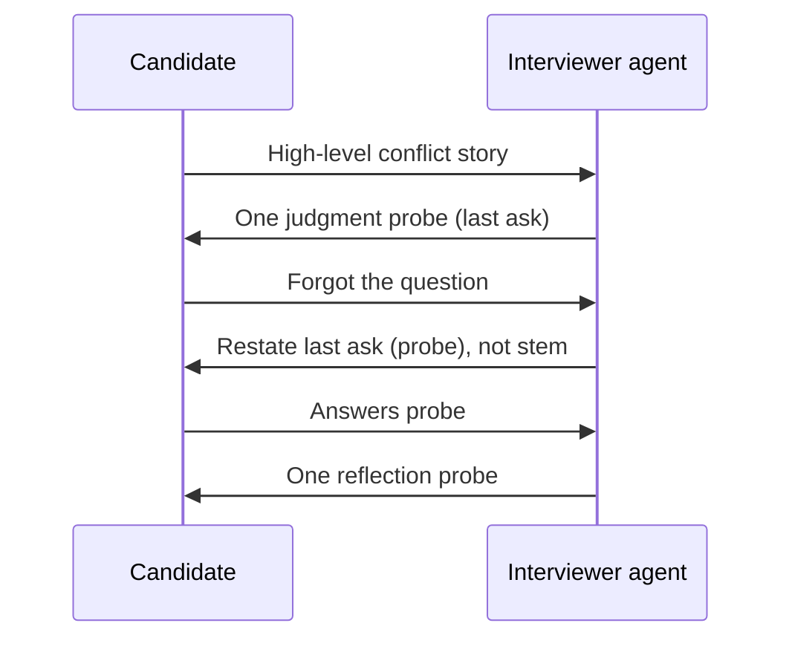

# Walkthroughs

Anonymized **composite** paths. Not real candidate records.  
Purpose: show how the overview map routes — not how production sentences sound.

---

## Walkthrough 1 — Normal deepen → re-anchor to last ask → continue

**Type:** `behavioral`

| Turn | Candidate (paraphrase) | Judgment | Action class |
|------|------------------------|----------|--------------|
| 0 | *(interviewer already asked a stem about teamwork conflict)* | — | — |
| 1 | Describes a conflict at a high level, little decision detail | Normal → concrete episode, missing judgment | `Strategy_Pack(behavioral)` → probe judgment → `Ask_Single_Open_Question` |
| 2 | “Sorry — what was the question again?” | `Need_Question_Reanchor` | `Restate_Last_Interviewer_Question` (**the judgment probe from turn 1**, not the stem) |
| 3 | Answers with a concrete choice and trade-off | Normal → reflection still thin | `Strategy_Pack(behavioral)` → probe reflection → `Ask_Single_Open_Question` |

### Why this walkthrough exists

A common failure is restating the **stem** at turn 2.  
The contract says: restate the **last interviewer question in dialogue**.

---

## Walkthrough 2 — Type boundary beats curiosity (`job-transition`)

**Type:** `job-transition`

| Turn | Candidate (paraphrase) | Judgment | Action class |
|------|------------------------|----------|--------------|
| 1 | Venting about a previous employer / management | Type safety trigger | `Type_Specific_Boundary` → reframe to environment-fit / what they need to thrive |
| 2 | Describes the kind of environment where they work best | Normal | `Strategy_Pack(job-transition)` → one values or pattern probe |

### Why this walkthrough exists

Overview choice **B**: specialty boundaries are a first-class dashed node, not an afterthought in prose.

---

## Walkthrough 3 — `fallback` keeps the interview moving

**Type:** `fallback`

| Turn | Candidate (paraphrase) | Judgment | Action class |
|------|------------------------|----------|--------------|
| 1 | Gives a usable but underspecified answer; no specialty pack clearly fits | Normal | `Strategy_Pack(fallback)` → one clarifying cell **or** one example ask |
| 2 | Adds a concrete scene | Normal | Continue with one more safe deepen — still without forcing a wrong competency frame |

### Why this walkthrough exists

`fallback` is about **safe continuation**: keep dialogue usable and neutral when no specialized lens should be applied.

---

## Walkthrough 4 — Content-related empty → soft reinvite (not a deepen)

**Type:** `behavioral` (shared content family; any typed item similar)

| Turn | Candidate (paraphrase) | Judgment | Action class |
|------|------------------------|----------|--------------|
| 0 | *(stem already asked)* | — | — |
| 1 | Only fillers / “I don’t know” with no elaboration | Content-related: `Empty_Or_Fillers` | `Soft_Reinvite` (or soft re-ask with **last ask**)—**no** “when you mentioned…” |
| 2 | Offers a thin but real episode word | Thin-but-substantive (edge of normal) | One **anchored** open question—not bare “say more” |
| 3 | Adds usable detail | Normal | `Strategy_Pack(behavioral)` → one family only |

### Why this walkthrough exists

Empty and “forgot the question” are different content recoveries. Empty must not invent premises; very short-with-anchor is not the same as empty. Families: [abnormal-responses.md](../docs/abnormal-responses.md).

---

## Walkthrough 5 — Stop brake misses; one extra probe, then advance

**Type:** any; illustrates [stop-conditions.md](../docs/stop-conditions.md)

| Beat | What happens | Contract read |
|------|----------------|---------------|
| 1 | Candidate finishes a substantive answer after at least one prior follow-up | Stop classifier and follow-up **generator** start **in parallel** |
| 2 | Generator finishes first; probe is committed to TTS | Stop returns `stop` **too late** → **intercept fails** |
| 3 | Candidate hears **one** extra follow-up | Often acceptable; avoid stacking awkward probes |
| 4 | Item advances (next stem), often after transition copy | Time / max **follow-up rounds** (stem turn not counted) remain hard backstops |

### Why this walkthrough exists

Stop is a **fast parallel brake**, not a deep offline judge. Missed intercept ≠ total failure; continuous awkward chat is the failure mode to watch.
