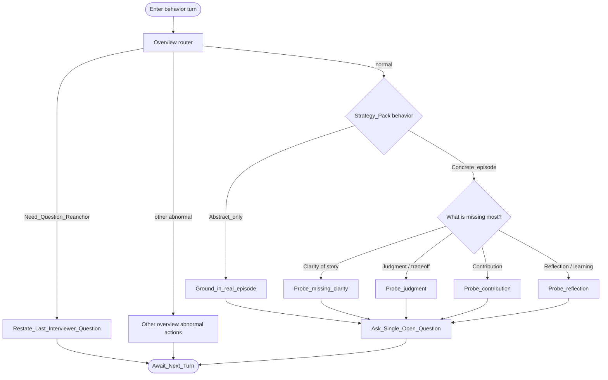

# Type map: `behavior`

Extends the [overview](./overview.md). Shows how the normal pack and re-anchor tone specialize — still without production copy.

## Pack rules

- Choose **one** branch per turn.  
- After one deep follow-up on a cell, prefer shifting aspect next turn.  
- No premise invention when grounding.
