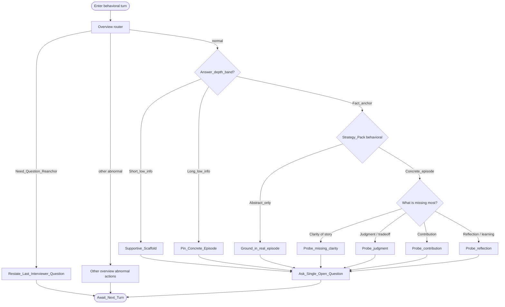

# Type map: `behavioral`

Extends the [overview](./overview.md). Shows how the normal pack specializes — still without production copy.

## Pack rules

- Overview **answer-depth band** runs before this pack: short-low / long-low never enter the STAR deepen branches on the same turn.  
- Choose **one** branch per turn.  
- After one deep follow-up on a cell, prefer shifting aspect next turn.  
- No premise invention when grounding.  
- Ideal / hypothetical answers (“I would…”) are still **Abstract_only**: ground in a real episode; do not deepen the plan as if it were past behavior.  
- If no episode can be elicited, stop unlimited digging and defer to product **dialogue-termination** (out of scope for this map).

Field note: [failure-case-behavioral-evidence.md](../docs/failure-case-behavioral-evidence.md).  
Difficulty banding: [failure-case-difficulty-mismatch.md](../docs/failure-case-difficulty-mismatch.md).
