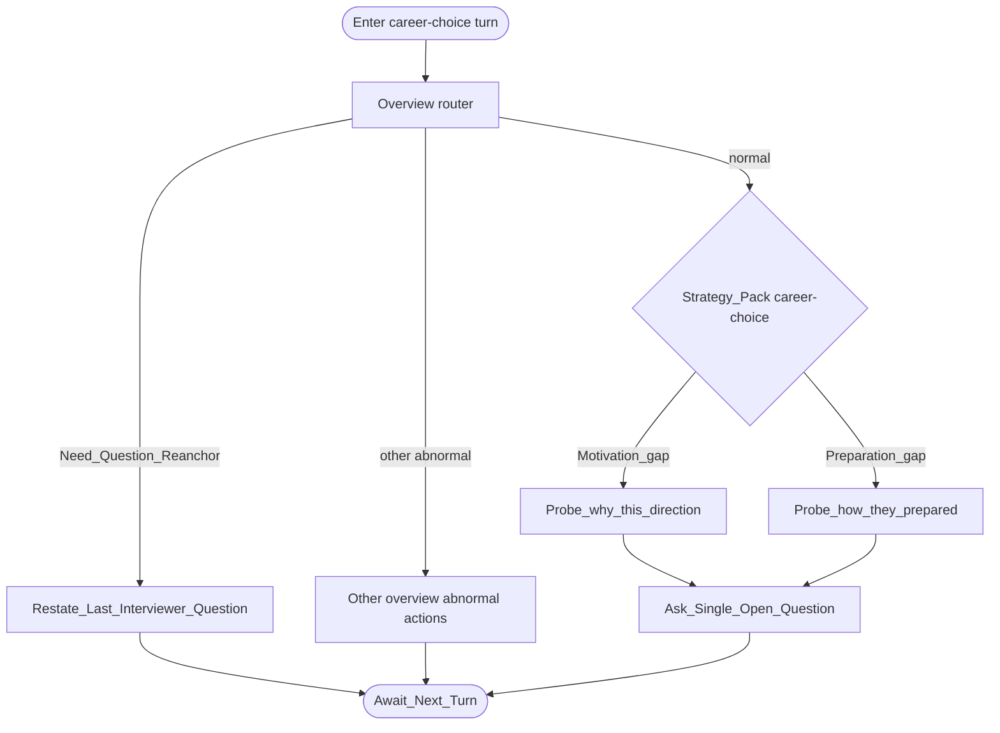

# Type map: `career-choice`

Extends the [overview](./overview.md).

## Pack rules

- Assess **decision process**, not whether the path is “correct”.  
- Pick motivation **or** preparation in one turn — not both stacked.  
- Stay within the career topic boundary of the stem thread.
