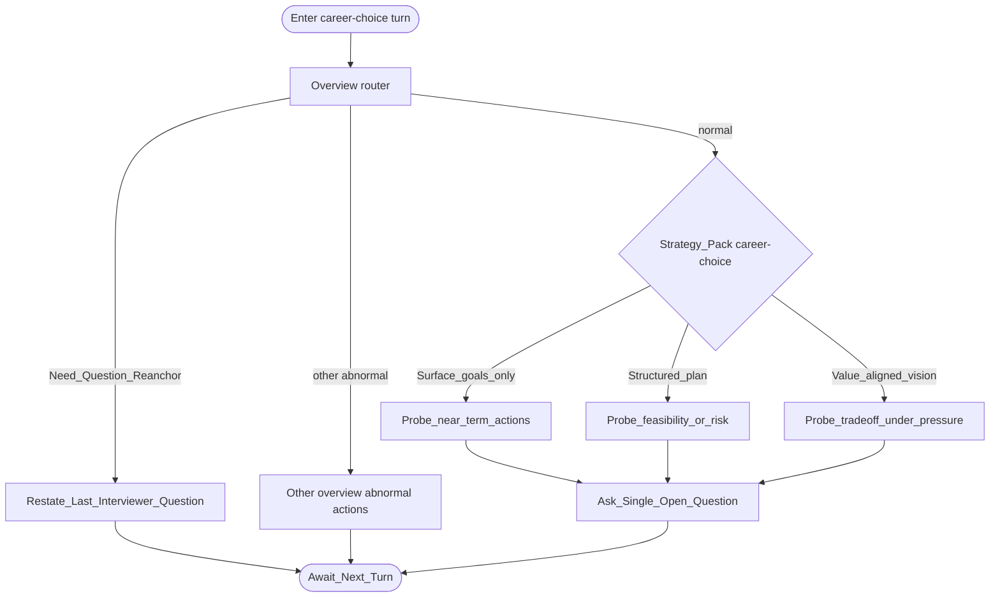

# Type map: `career-choice`

Extends the [overview](./overview.md). Normal pack grades **planning maturity**, then probes one step deeper.

## Pack rules

- Assess **decision process and maturity**, not whether the path is “correct.”  
- One maturity mode per turn: build plan → stress feasibility → value trade-off.  
- Stay within the career topic boundary of the stem thread.  
- Do not stack motivation + preparation + trade-off in one ask.
