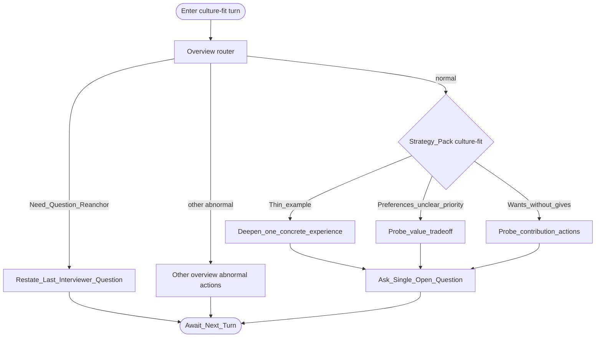

# Type map: `culture-fit`

Extends the [overview](./overview.md). Normal pack deepens **preferences and contribution**—infer fit without scoring culture aloud.

## Pack rules

- Infer from **behavior and trade-offs**, not from “do you like our values” checklists.  
- Trade-off probes need two preferences the candidate already voiced—do not invent A vs B.  
- Balance “what they seek” with “what they contributed” when the narrative is wants-only.  
- One open question per turn; stay non-evaluative in wording.
