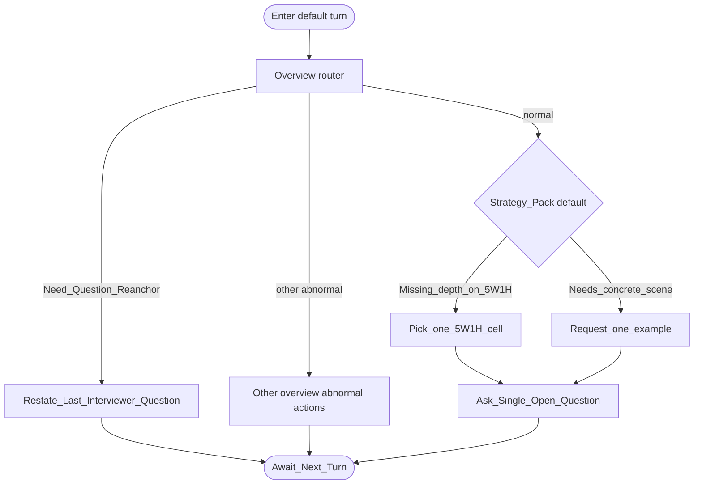

# Type map: `default`

Extends the [overview](./overview.md). Used when no specialized competency model fits.

## Pack rules

- Neutral-curious: deepen understanding, don’t score aloud.  
- Exactly one 5W1H cell **or** one example request — never both stacked.
