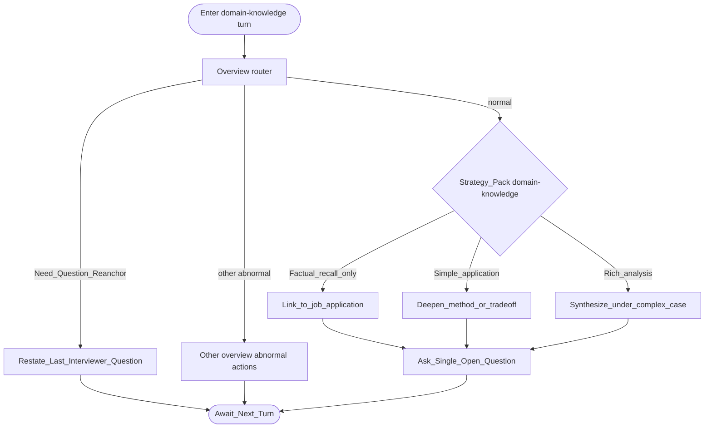

# Type map: `domain-knowledge`

Extends the [overview](./overview.md).

**Intent:** oral **domain / professional knowledge** checks—closest to a spoken technical interview item, not soft behavioral storytelling.

## Pack rules

- Probe **what they know and how they use it** in the role’s domain (tools, concepts, procedures, judgment).  
- Move **one proficiency step** per turn: recall → application → analysis/synthesis.  
- Prefer job-relevant depth over trivia or gotcha quizzes.  
- Synthesis needs an anchor in what they already claimed.  
- One open question per turn; no multi-part oral exams stacked.
