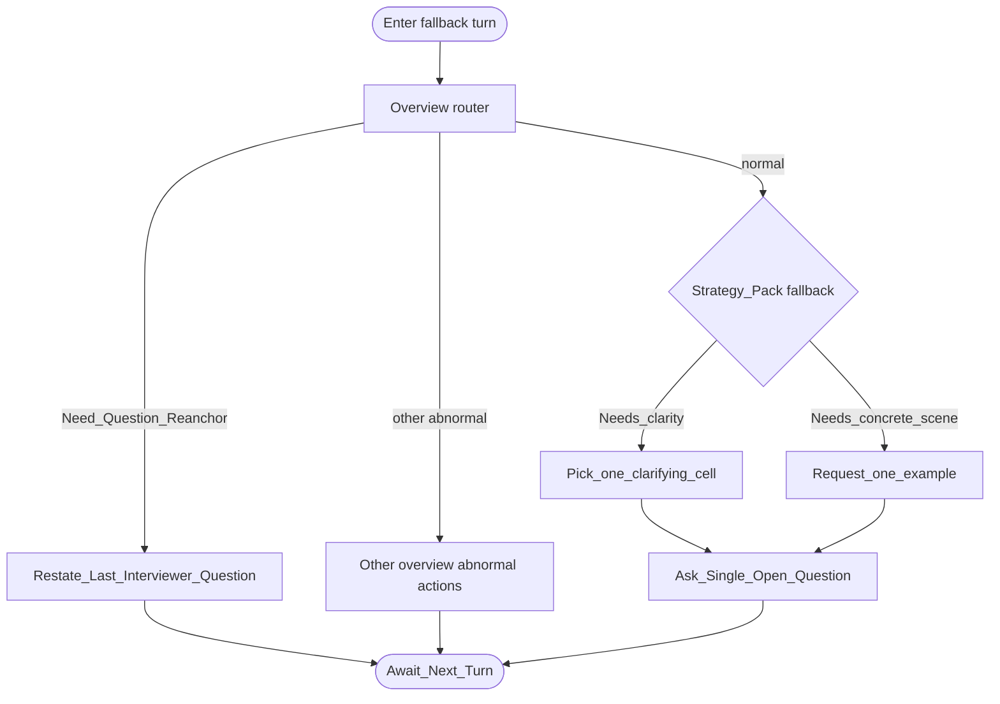

# Type map: `fallback`

Extends the [overview](./overview.md).

**Role of this pack:** safe **continuation** of the interview when no specialized competency frame fits. Prioritize keeping the dialogue usable and neutral — not forcing a clever but wrong lens.

## Pack rules

- Goal: **continue safely** — clarify or concretize without over-fitting a specialty model.  
- Neutral-curious; do not score aloud.  
- Exactly one clarifying deepen **or** one example request — never both stacked.
