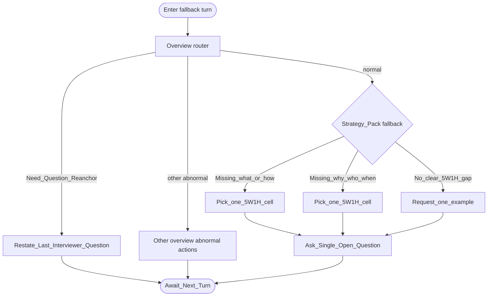

# Type map: `fallback`

Extends the [overview](./overview.md).

**Role of this pack:** safe **continuation** when no specialized competency frame fits (`default` pack in some product matrices). Prioritize keeping the dialogue usable and neutral.

## Pack rules

- Goal: **continue safely** — clarify or concretize without forcing a wrong specialty lens.  
- Choose the **single** most missing 5W1H cell (what / how / why / who / when-where), or fall back to one example request.  
- Neutral-curious; do not score aloud.  
- Never stack multiple 5W1H asks in one turn.
