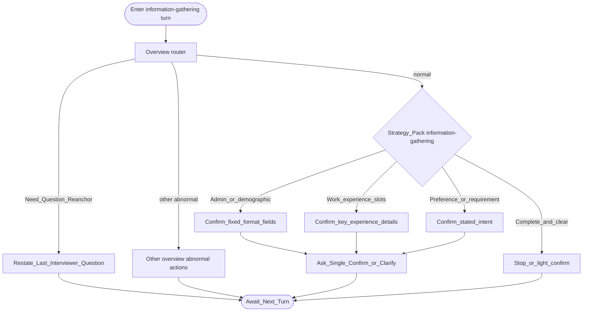

# Type map: `information-gathering`

Extends the [overview](./overview.md). Normal pack optimizes for **collecting and confirming slots**, then stop—not open-ended exploration.

## Pack rules

- Goal is **accurate capture**, not competency digging.  
- Do not re-ask slots already clearly answered.  
- Prefer short confirmations once facts are complete.  
- Re-anchor still uses **last interviewer ask** (often the slot question itself).
