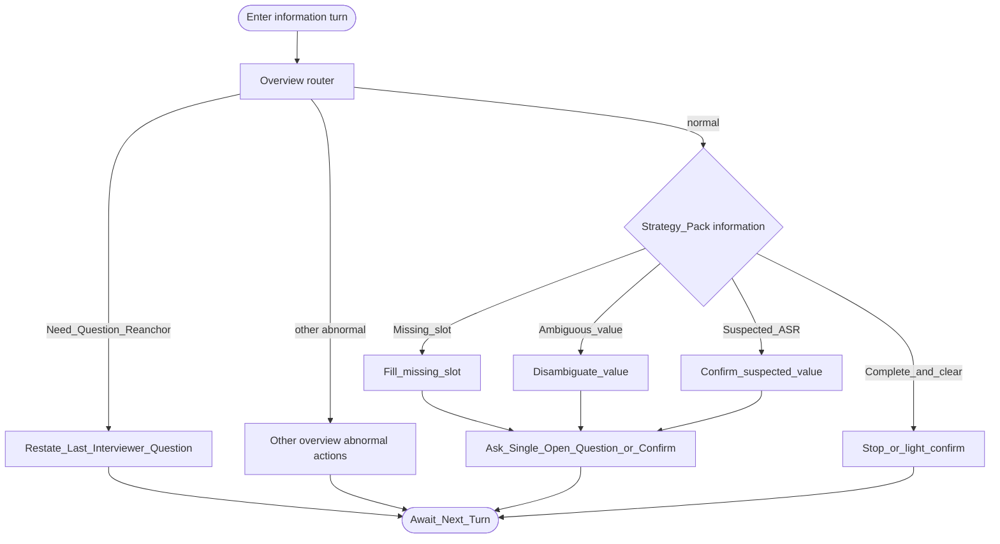

# Type map: `information`

Extends the [overview](./overview.md). Normal pack optimizes for **slot completeness and confirmation**, then stop.

## Pack rules

- Do not re-ask slots already clearly answered.  
- Prefer confirmations over exploratory chatting once facts are complete.  
- Re-anchor still uses **last interviewer ask** (often the slot question itself).
