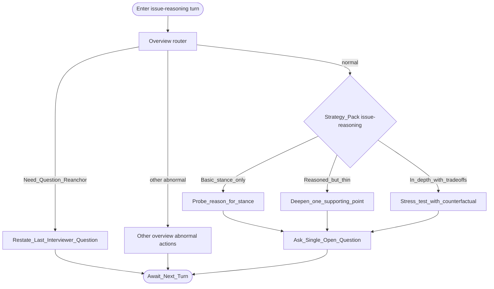

# Type map: `issue-reasoning`

Extends the [overview](./overview.md).

**Intent:** open-ended issue / debate items that test **critical thinking and argumentation**.

## Pack rules

- Target is **reasoning process**, not whether the conclusion is “correct.” Stay neutral.  
- Grade sophistication, then one mode: build reasons → deepen one support → resilience under a counterfactual / opposing view.  
- Do not turn the item into a domain quiz or a values checklist.  
- Echo the candidate’s stance only to ground one clear point; do not invent positions.  
- One open question per turn.
