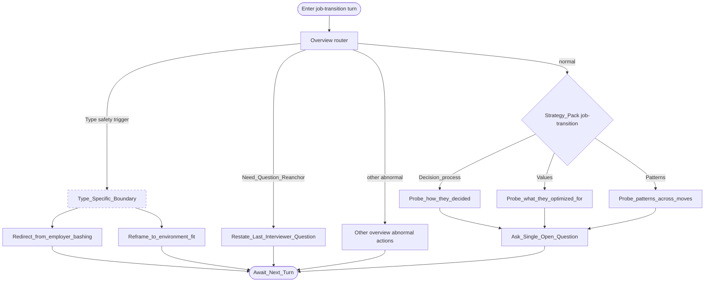

# Type map: `job-transition`

Extends the [overview](./overview.md). Demonstrates overview choice **B**: type boundary as a dashed override.

**Intent:** reasons and patterns behind **leaving a job / changing employers**—离职与求职动因.

## Pack rules

- Non-judgmental: understand drivers of moves; don’t prosecute past choices.  
- When negativity toward former employers (or managers/colleagues) appears, **boundary actions outrank curiosity**—redirect to environment fit / future seeking; do not dig grievance detail.  
- One probe family per turn: decision process, values, or patterns.  
- Prefer *how/what* over accusatory *why* when discussing past moves.  
- Distinct from [`career-choice`](./career-choice.md) (future planning maturity).

Field note: [failure-case-job-transition-boundary.md](../docs/failure-case-job-transition-boundary.md).
