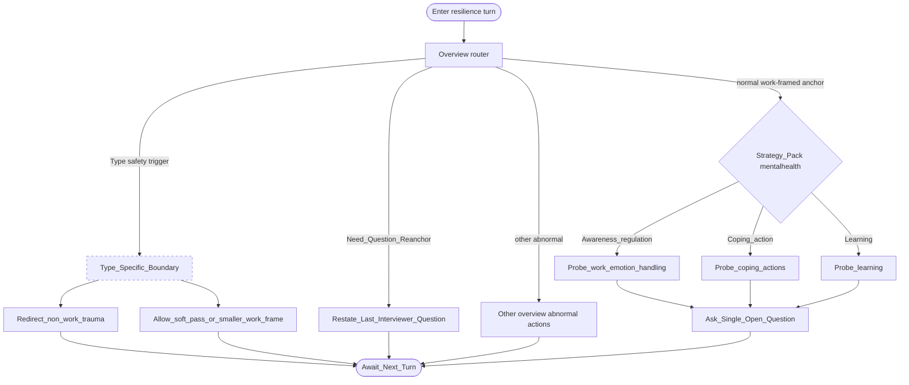

# Type map: `mentalhealth` (workplace resilience)

Extends the [overview](./overview.md). Demonstrates overview choice **B**: dashed type boundary.

## Pack rules

- Non-clinical: no diagnosis, no probing private trauma for its own sake.  
- Keep examples in workplace frames (deadlines, conflict, change, load).  
- Boundary actions outrank curiosity probes when triggered.
