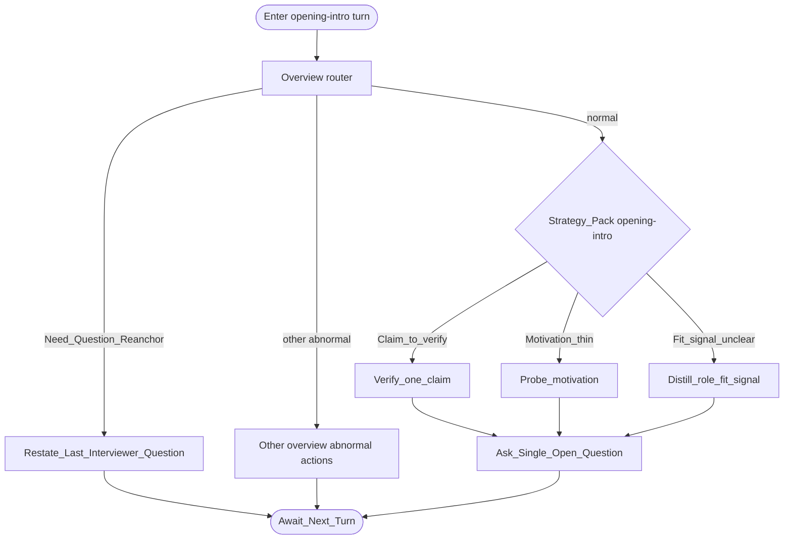

# Type map: `opening-intro`

Extends the [overview](./overview.md).

## Pack rules

- Opening turns set trust: keep asks concrete and answerable.  
- Thin intros still get **one** directed ask for role-relevant experience — not a lecture.  
- Re-anchor uses last interviewer ask (often the intro prompt itself early on).
