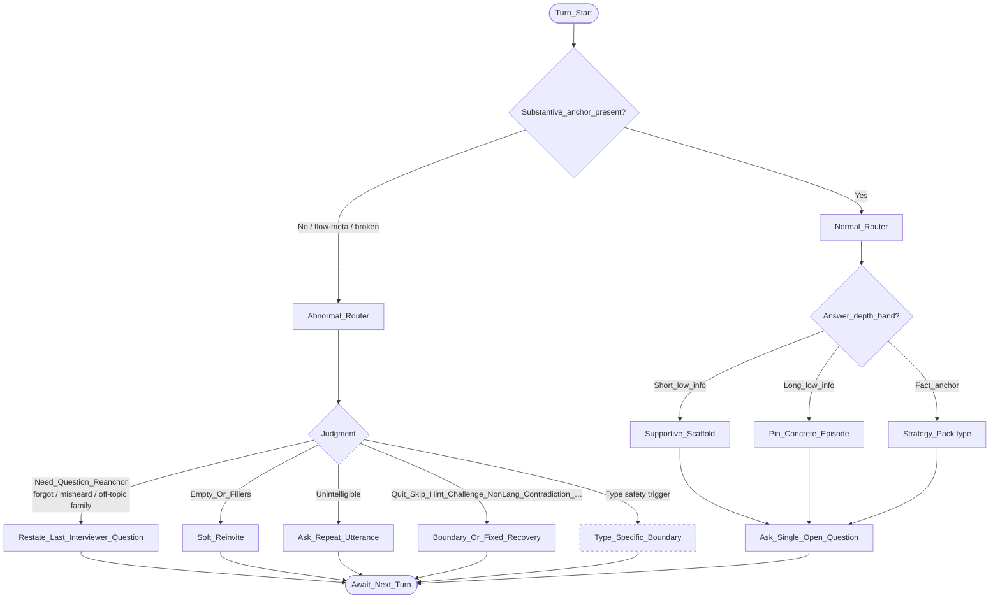

# Overview Decision Map

Shared router for all question types. **Action-level** only (no utterance copy).

## Design choices (locked)

| ID | Choice |
|----|--------|
| A | `Off_Topic` and `Forgot_Or_Misheard` merge into judgment **`Need_Question_Reanchor`**; action **`Restate_Last_Interviewer_Question`**. Type maps may still tune tone. |
| B | Type-specific safety/boundary appears once as **`Type_Specific_Boundary`** (dashed). Details live in type maps / matrix. |
| C | Normal path does **not** jump straight to typed deepen. After the lane is normal, judge **answer-depth band** first; only **fact-anchor** turns enter **`Strategy_Pack(type)`**. |
| D | Common probe families stay in principles / type docs; this overview only shows the shared router edges. |

## Diagram

## Node catalog

### Judgments

| Node | Fires when (conceptual) |
|------|-------------------------|
| `Substantive_anchor_present?` | Latest turn is ready for *some* normal handling: not pure meta/empty/gibberish/re-anchor demand. **Having entered Normal does not mean typed deepen is allowed.** |
| `Answer_depth_band?` | Inside Normal: classify how much usable content the latest answer carries (short-low / long-low / fact-anchor). Primary cues are **answer depth** and **usable information**, not inferred “ability.” |
| `Need_Question_Reanchor` | Candidate forgot/misheard the ask, or the turn requires putting “the question” back on the table (includes many off-topic recoveries) |
| `Empty_Or_Fillers` | No content beyond silence/fillers/“I don’t know” without elaboration |
| `Unintelligible` | No recoverable intent even after silent ASR interpretation |
| `Boundary_Or_Fixed_Recovery` bucket | Quit, skip, hint-seeking, interviewer challenge, language violation, hard contradiction, etc. (may be expanded in implementation) |
| `Type_Specific_Boundary` | Type pack declares a safety/ethics override (e.g. non-work trauma on resilience items) |

### Actions

| Node | Meaning |
|------|---------|
| `Restate_Last_Interviewer_Question` | Re-place the **last question asked by the interviewer in this dialogue** (stem only if it was last), then invite answer |
| `Soft_Reinvite` | Invite contribution without inventing premises |
| `Ask_Repeat_Utterance` | Ask the candidate to say their answer again — **not** the same as restating the exam question |
| `Boundary_Or_Fixed_Recovery` | Constrained recovery / boundary move (implementation-private wording) |
| `Type_Specific_Boundary` | Type override (see matrix) |
| `Supportive_Scaffold` | Lower difficulty: one recallable handle (scene, first line said, one reaction). Still **one** open question. Not a hard-abnormal lane. |
| `Pin_Concrete_Episode` | Long but low-information talk → pin **one** real event / one person / one time. Do not ask for methodology or judgment criteria yet. |
| `Strategy_Pack(type)` | Select exactly one probe family allowed for this type — only when a **fact anchor** is already present |
| `Ask_Single_Open_Question` | Emit one open question; end turn |
| `Await_Next_Turn` | Wait for next candidate utterance |

## Answer-depth bands (Normal only)

| Band | Observable shape (conceptual) | Action |
|------|-------------------------------|--------|
| `Short_low_info` | Very little situational / behavioral / factual content | `Supportive_Scaffold` |
| `Long_low_info` | Many words, mostly principles / slogans / no episode | `Pin_Concrete_Episode` |
| `Fact_anchor` | At least one referable person / event / action / number | `Strategy_Pack(type)` (optional deepen; not mandatory every turn) |

**Ceiling:** probe difficulty should generally not rise above what the candidate has already made clear. Lower when thin; stop when enough; do not default to “one more abstract layer.”

**Not the same as Abnormal:** short-low and long-low are still **valid interview turns**. They need easier asks, not quit/challenge recovery tone.

Field note: [../docs/failure-case-difficulty-mismatch.md](../docs/failure-case-difficulty-mismatch.md).

## Critical edge note

`Restate_Last_Interviewer_Question` **must not** be hard-wired to the original stem variable.  
Stem injection remains valid context for *what the thread is about*; re-anchor content comes from dialogue history of interviewer asks.

## Related

- Type matrix / normal packs对照: [../docs/question-types.md](../docs/question-types.md)  
- Abnormal recoveries (shared + type overrides): [../docs/abnormal-responses.md](../docs/abnormal-responses.md)  
- Type maps: [behavioral](./behavioral.md), [situational](./situational.md), [career-choice](./career-choice.md), [job-transition](./job-transition.md), [opening-intro](./opening-intro.md), [fallback](./fallback.md)  
- Principles: [../docs/principles.md](../docs/principles.md)
