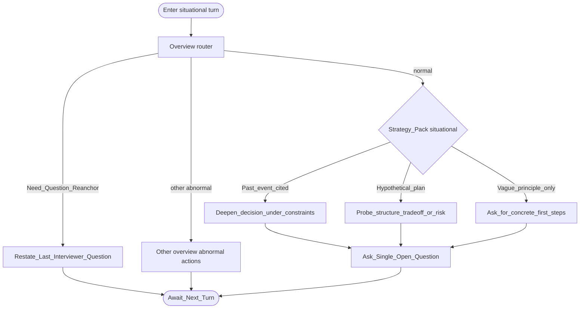

# Type map: `situational`

Extends the [overview](./overview.md).

## Pack rules

- Classify past-event vs hypothetical before probing — both (and thin stance / mixtures) can be **legal** on situational items.  
- Do not overgeneralize one good rule: past-tense probes belong to real episodes; risk probes need a brake (no chained “what if that fails” on the same line).  
- After one risk probe, shift dimension.  
- One open question per turn.  
- Hold the shared hypothetical frame when the answer is still a plan; dig experience when a resonant past episode is clearly offered.

Field note: [failure-case-situational-overgeneralize.md](../docs/failure-case-situational-overgeneralize.md).
