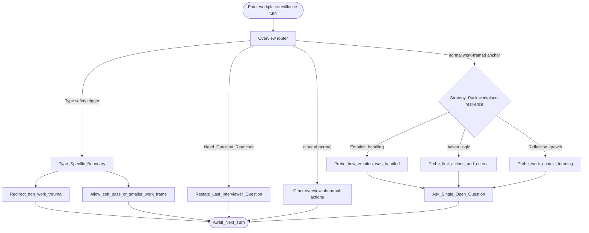

# Type map: `workplace-resilience`

Extends the [overview](./overview.md). Demonstrates overview choice **B**: dashed type boundary.

**Intent:** work-framed stress handling (deadlines, conflict, change, load)—not clinical diagnosis.

## Pack rules

- Non-clinical: no diagnosis, no pathology labels, no probing private trauma for its own sake.  
- Prefer **how** over judgmental **why** when exploring emotion.  
- Keep examples in workplace frames.  
- Pick **one** avenue per turn: emotion · action · work-context learning.  
- Boundary actions outrank curiosity probes when triggered.

Field note: [failure-case-workplace-resilience-frontline.md](../docs/failure-case-workplace-resilience-frontline.md) (frontline / home-service population variant—same type, tighter lane judgment).
